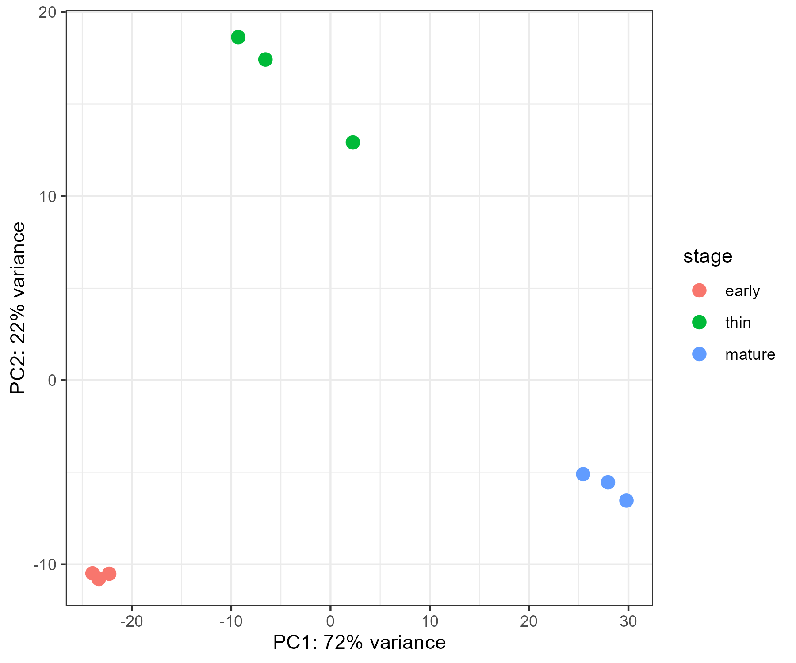
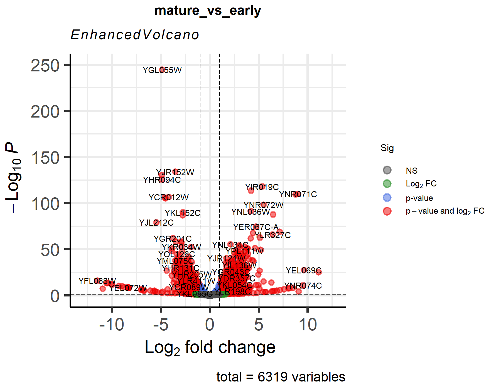
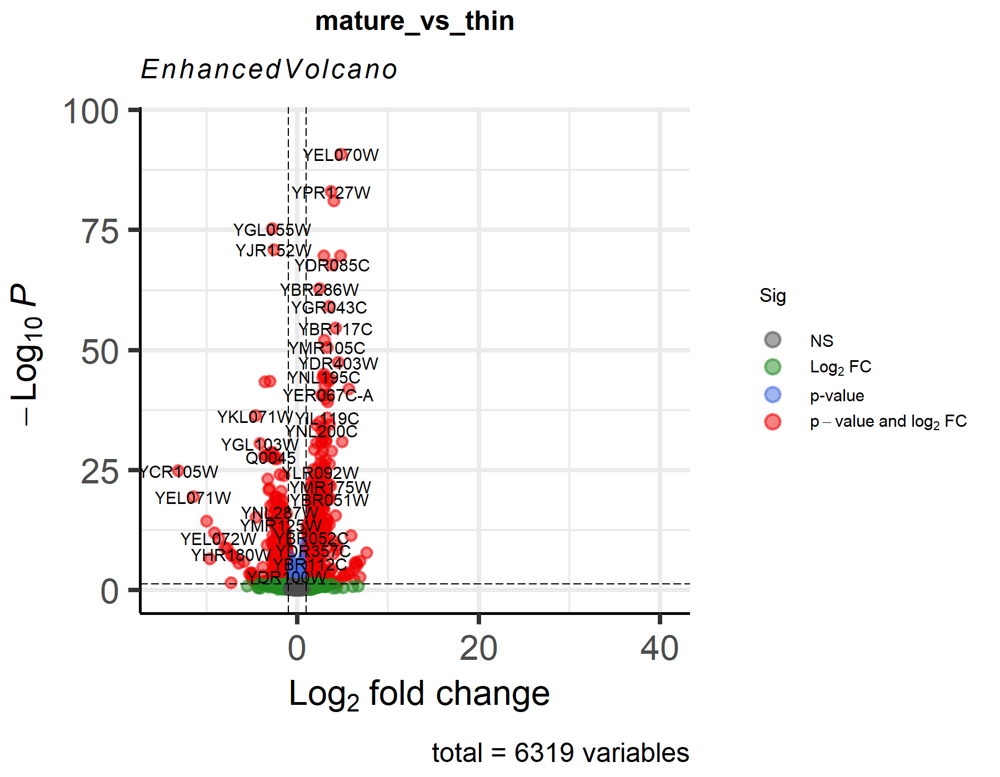
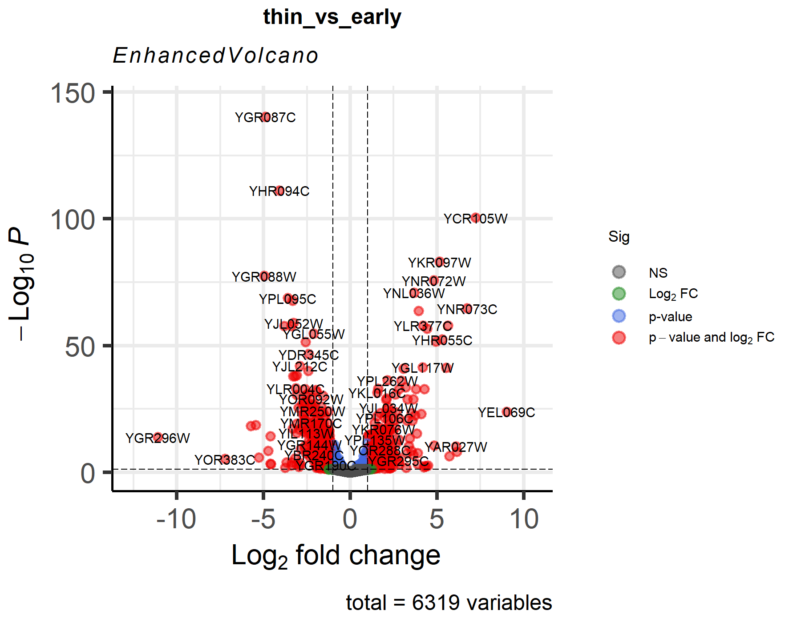
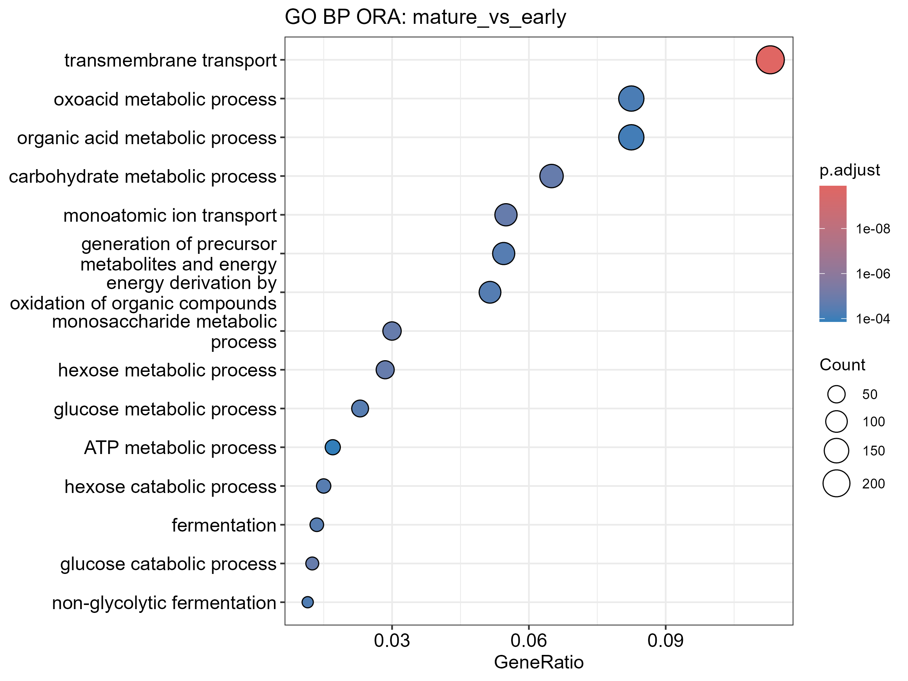
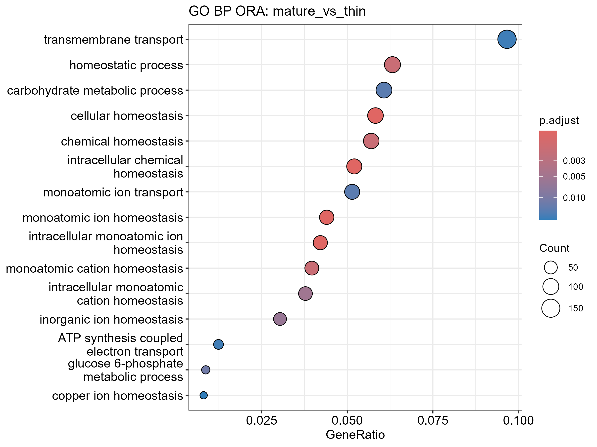
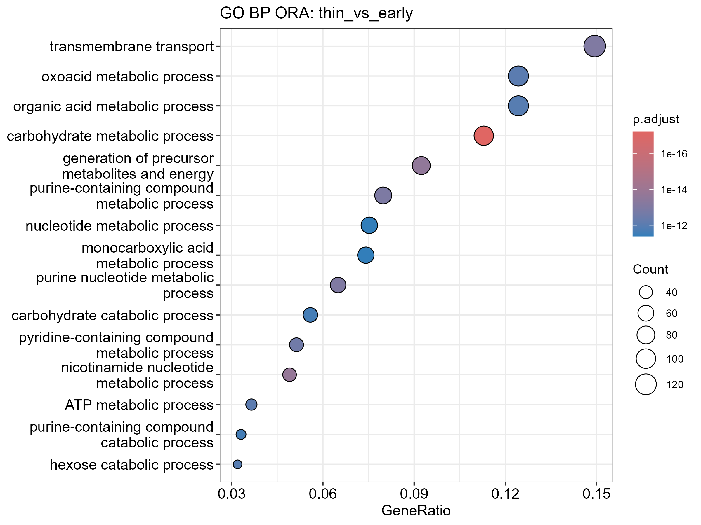
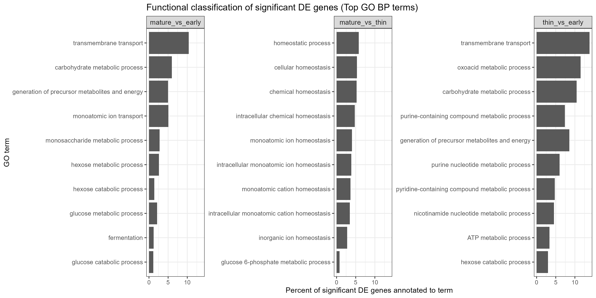
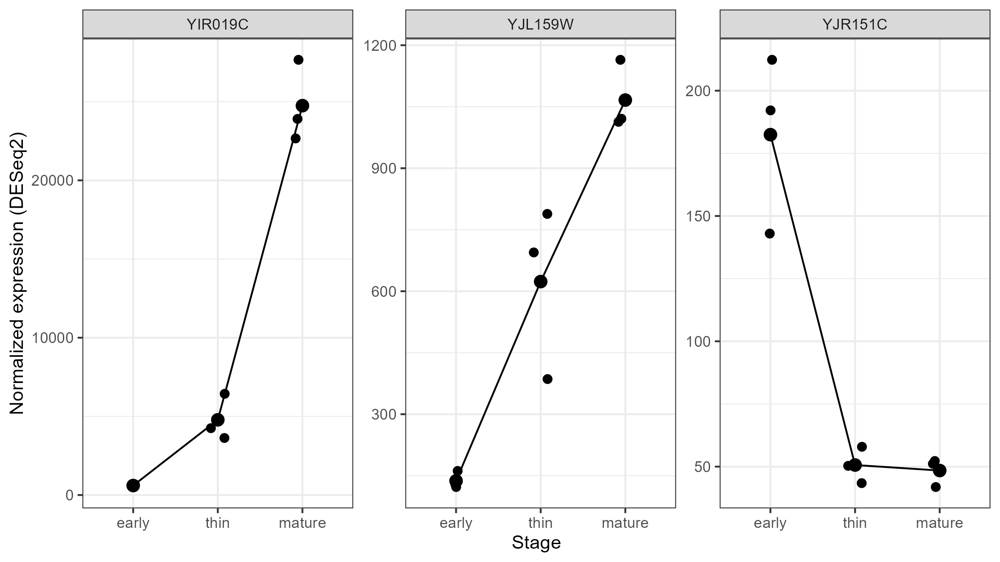

# Assignment 2 for BINF6110, Genomic Methods for Bioinformatics

## Matei Dan-Dobre

### 1407506

# Introduction

The ability to quantify genome-wide gene expression has transformed modern biology by enabling systematic investigation of cellular responses to environmental and developmental changes. RNA sequencing (RNA-seq) is now the standard approach for transcriptome profiling due to its high sensitivity, broad dynamic range, and capacity to detect both known and novel transcripts (Wang et al., 2009). In bulk RNA-seq experiments, RNA from multiple cells within a biological condition is sequenced to estimate gene expression levels, allowing statistical comparison between experimental groups. However, RNA-seq data consist of discrete count measurements that exhibit biological and technical variability, necessitating statistical frameworks specifically designed for overdispersed count data. Methods such as DESeq2 model RNA-seq counts using negative binomial distributions and incorporate empirical Bayes shrinkage to provide stable estimates of dispersion and fold change (Love et al., 2014). These approaches enable rigorous identification of differentially expressed genes while controlling for multiple testing.

The budding yeast Saccharomyces cerevisiae serves as an ideal model organism for studying gene regulatory responses to environmental stress and developmental transitions. During biological wine aging, specialized strains of S. cerevisiae form a surface-associated biofilm known as velum. Velum is a membranous structure that develops at the air–liquid interface of fermenting wine and allows yeast cells to persist under oxidative and nutrient-limited conditions. This adaptation is essential for the production of certain aged wines and represents a complex physiological transition involving metabolic reprogramming, stress tolerance, and cell surface remodeling (Alexandre, 2013).

Biofilm formation in yeast is a coordinated developmental process involving adhesion, extracellular matrix production, and global transcriptional shifts. Members of the FLO gene family, particularly FLO11, play central roles in adhesion and biofilm architecture (Verstrepen & Klis, 2006). In addition to adhesion-related genes, successful biofilm development requires extensive metabolic adaptation. As yeast cells transition from fermentative growth to oxidative metabolism, genes involved in respiration, membrane transport, ion homeostasis, and carbohydrate metabolism are frequently differentially regulated (Gasch et al., 2000). Environmental stress responses are also activated under nutrient limitation and oxidative conditions, resulting in coordinated transcriptional programs that enable survival (Gasch et al., 2000). Understanding these regulatory shifts during velum development provides insight into both industrial fermentation processes and broader principles of fungal adaptation.

The dataset analyzed in this study consists of RNA-seq profiles from three developmental stages of velum formation (early, thin, and mature) with biological replicates at each stage. Because gene expression differences across developmental time points may involve hundreds or thousands of genes, systematic statistical comparison is required. Differential expression analysis was performed using DESeq2, which estimates size factors to normalize sequencing depth, models dispersion across biological replicates, and performs hypothesis testing using Wald statistics (Love et al., 2014). Log2 fold-change shrinkage via the apeglm method was applied where appropriate to reduce noise in effect size estimates while preserving biologically meaningful large differences (Zhu et al., 2018). Multiple testing correction was implemented using the Benjamini–Hochberg procedure to control the false discovery rate (Benjamini & Hochberg, 1995), ensuring statistical rigor when evaluating thousands of genes simultaneously.

While differential expression identifies genes whose expression levels change significantly between stages, interpretation of these results requires biological context. Functional annotation assigns genes to known biological categories such as Gene Ontology (GO) terms, protein families, and metabolic pathways. The Gene Ontology provides a structured, hierarchical vocabulary describing gene products in terms of biological processes, molecular functions, and cellular components (Ashburner et al., 2000). Mapping differentially expressed genes to GO categories enables identification of overarching biological themes associated with developmental transitions. Beyond classification, over-representation analysis (ORA) statistically evaluates whether specific GO categories are enriched among differentially expressed genes relative to a genomic background (Subramanian et al., 2005). Enrichment analysis helps distinguish coordinated biological responses from random fluctuations in gene expression.

In the context of velum development, enrichment of processes related to carbohydrate metabolism, membrane transport, stress response, or ion homeostasis would be consistent with known physiological adaptations to oxidative, nutrient-limited environments. Conversely, repression of fermentative pathways may reflect the metabolic shift toward respiratory growth characteristic of surface-associated yeast populations. By integrating differential expression analysis with functional annotation and enrichment testing, it is possible to move from gene-level changes to pathway-level biological interpretation.
The objective of this study is therefore to characterize transcriptional changes across early, thin, and mature stages of velum development using a statistically rigorous RNA-seq workflow. Differential expression analysis was conducted using DESeq2 to identify genes with significant stage-dependent expression changes. Functional annotation was performed to categorize differentially expressed genes by Gene Ontology Biological Process terms, and over-representation analysis was used to identify biological processes significantly enriched at each developmental transition. Together, these approaches provide a comprehensive framework for understanding the molecular mechanisms underlying velum formation and maturation in Saccharomyces cerevisiae.

---

# Methods

## Computational Environment

All preprocessing and transcript quantification were performed in Windows Subsystem for Linux (WSL) running Ubuntu 22.04 LTS. Downstream statistical and functional analyses were conducted in R (version 4.3.x; R Core Team, 2023). All command-line scripts are provided in the scripts/ directory, and the complete R workflow is documented in scripts/04_deseq2_ora.R.

---

## Data Acquisition and FASTQ Preparation

Raw RNA-seq data were downloaded from the NCBI Sequence Read Archive (SRA) using accession numbers corresponding to three developmental stages of velum formation (early, thin, and mature; three biological replicates per stage).
Downloads and FASTQ conversion were performed using SRA Toolkit v3.x, specifically the fasterq-dump and prefetch utilities (NCBI SRA Toolkit, 2023). Automated download and compression were handled using:

[`scripts/01_download_sra.sh`](scripts/01_download_sra.sh)

This script attempted direct FASTQ conversion via fasterq-dump and implemented a fallback strategy using prefetch when necessary to ensure robust data retrieval. Resulting FASTQ files were gzip-compressed and stored in data/fastq/ (which are not present in this GitHub, as per .gitignore).

---

## Quality Control

Sequencing quality assessment was performed using FastQC v0.11.x (Andrews, 2010), and summary reports were generated using MultiQC v1.x (Ewels et al., 2016). These steps were automated via:

[`scripts/02_qc.sh`](scripts/02_qc.sh)

Quality reports were saved in results/qc/ and inspected to verify overall sequence quality, adapter content, and base quality distribution prior to quantification.

---

## Reference Preparation

The Saccharomyces cerevisiae reference transcriptome (R64-1-1 cDNA) and corresponding gene annotation (GTF; Ensembl release 111) were downloaded from the Ensembl FTP repository. The transcriptome FASTA file was decompressed and used to construct a Salmon index.

---

## Salmon Index Construction

Transcriptome indexing was performed using Salmon v1.10.3 (Patro et al., 2017) with a k-mer size of 31:

salmon index \
 -t reference/Saccharomyces_cerevisiae.R64-1-1.cdna.all.fa \
 -i reference/salmon_index \
 -k 31
 
Salmon uses a lightweight quasi-mapping approach (pufferfish index) for efficient transcript-level quantification (Patro et al., 2017).

---

## Transcript Quantification

Transcript abundance was quantified in single-end mode using Salmon v1.10.3 with selective alignment validation and bias correction options enabled (--validateMappings, --gcBias, --seqBias, --posBias). Quantification was automated using:

[`scripts/03_salmon_quant.sh`](scripts/03_salmon_quant.sh)

For each sample, Salmon generated transcript-level abundance estimates in results/salmon/SRR105516*/quant.sf (which are not present in this GitHub, as per .gitignore).

---

## Transcript-to-Gene Summarization

Transcript-level abundance estimates were imported into R and summarized to gene-level counts using tximport v1.x (Soneson et al., 2015). A transcript-to-gene mapping table was generated by parsing the Ensembl GTF annotation file. Tximport accounts for transcript length differences when aggregating to gene-level counts, improving downstream differential expression inference (Soneson et al., 2015).

All implementation details are provided in [`scripts/04_deseq2_ora.R`](scripts/04_deseq2_ora.R).

---

## Differential Expression Analysis

Differential expression analysis was conducted using DESeq2 v1.x (Love et al., 2014). A DESeqDataSet object was constructed using the design formula:

∼stage\sim \text{stage}∼stage

where stage included early, thin, and mature levels.

Genes with fewer than 10 total counts across all samples were removed prior to model fitting. DESeq2 estimates size factors to normalize sequencing depth, models dispersion across biological replicates using a negative binomial framework, and performs Wald tests to assess statistical significance (Love et al., 2014).
Three pairwise contrasts were evaluated:

- thin vs. early

- mature vs. early

- mature vs. thin

For contrasts involving the reference level (early), log2 fold-change shrinkage was performed using apeglm v1.x (Zhu et al., 2018) to reduce noise in effect size estimation.

Multiple testing correction was performed using the Benjamini–Hochberg false discovery rate (FDR) method (Benjamini & Hochberg, 1995). Genes with adjusted p-values < 0.05 and |log2 fold change| ≥ 1 were considered significantly differentially expressed.

---

## Functional Annotation

Significant genes were annotated using the org.Sc.sgd.db annotation package (Bioconductor) for Saccharomyces cerevisiae. Gene identifiers in ORF format (e.g., YGR087C) were mapped to Gene Ontology (GO) Biological Process terms (Ashburner et al., 2000). GO term metadata were retrieved using GO.db.

Functional classification was performed by calculating the proportion of significant genes associated with the top GO Biological Process terms in each contrast.

---

## Over-Representation Analysis (ORA)

Over-representation analysis was performed using clusterProfiler v4.x (Yu et al., 2012). The enrichGO() function was applied separately to each contrast with the following parameters:

- Ontology: Biological Process (BP)

- Key type: ORF

- Multiple testing correction: Benjamini–Hochberg

ORA tests whether a GO category contains more significant genes than expected by chance relative to the genomic background (Yu et al., 2012). Enriched terms were visualized using dot plots summarizing gene ratios and adjusted p-values.

---

## Data Visualization

Principal component analysis (PCA) was performed on variance-stabilized counts generated by DESeq2. Volcano plots were produced using EnhancedVolcano (Blighe et al., 2023). Heatmaps of highly variable genes were constructed using pheatmap (Kolde, 2019). Expression profiles of selected genes were visualized using normalized counts extracted via DESeq2.

---

## Reproducibility

All shell scripts ([`scripts/01_download_sra.sh`](scripts/01_download_sra.sh), [`scripts/02_qc.sh`](scripts/02_qc.sh), [`scripts/03_salmon_quant.sh`](scripts/03_salmon_quant.sh)) and R code ([`scripts/04_deseq2_ora.R`](scripts/04_deseq2_ora.R)) are provided. Session information including R version and package versions was recorded to ensure computational reproducibility.

---

# Results

Principal component analysis (PCA) was performed on variance-stabilized gene expression values to assess global transcriptomic structure across samples (Figure 1). The first principal component (PC1) explained 72% of the total variance, while the second principal component (PC2) explained 22%. Samples clustered according to developmental stage, with early, thin, and mature biofilm samples forming three distinct groups. Replicates within each stage clustered closely together, indicating consistency among biological replicates.

### Figure 1: Principal component analysis of transcriptomic profiles across velum developmental stages.
####Principal component analysis (PCA) was performed on variance-stabilized gene expression values derived from DESeq2. Each point represents one biological replicate (n = 3 per stage). Samples are colored by developmental stage (early, thin, mature). The first principal component (PC1) explains 72% of the total variance, and the second principal component (PC2) explains 22% of the variance. Samples cluster by developmental stage, indicating distinct global transcriptional profiles.

---

Differential expression analysis was conducted for three pairwise contrasts: thin vs. early, mature vs. early, and mature vs. thin. Volcano plots summarizing these contrasts are shown in Figure 2.

In the thin vs. early comparison, numerous genes exhibited significant differential expression at an adjusted p-value < 0.05 and |log₂ fold change| ≥ 1. Both upregulated and downregulated genes were observed. Several genes showed large magnitude fold changes, including genes with log₂ fold changes exceeding ±5.

The mature vs. early contrast exhibited widespread transcriptional changes, with a substantial number of genes meeting significance thresholds. This comparison showed both strong upregulation and downregulation, with some genes displaying log₂ fold changes greater than ±8.

The mature vs. thin comparison showed fewer genes with large fold changes relative to the mature vs. early contrast, though significant differential expression was still observed. Overall, the magnitude and number of differentially expressed genes varied across contrasts, with the most pronounced differences observed between mature and early stages.

Across all contrasts, differential expression results were adjusted for multiple testing using the Benjamini–Hochberg procedure.

### Figure 2: Volcano plots of differential gene expression across pairwise developmental stage comparisons.
####Volcano plots summarizing differential expression results for (A) thin vs. early, (B) mature vs. early, and (C) mature vs. thin comparisons. The x-axis shows log₂ fold change, and the y-axis shows –log₁₀ adjusted p-value. Genes meeting significance thresholds (adjusted p-value < 0.05 and |log₂ fold change| ≥ 1) are highlighted. Selected significantly differentially expressed genes are labeled. Multiple testing correction was performed using the Benjamini–Hochberg procedure.

---

To further examine transcriptional differences across stages, a heatmap of the top 50 most variable genes was generated using variance-stabilized expression values (Figure 3). Hierarchical clustering of samples separated the three developmental stages into distinct branches. Genes formed clusters corresponding to stage-specific expression patterns. Early samples clustered together and were distinct from thin and mature samples. Thin and mature samples also formed separate clusters, consistent with PCA results.

### Figure 3: Heatmap of the top 50 most variable genes across samples.
#### Heatmap showing variance-stabilized expression values for the 50 genes with the highest variance across all samples. Rows represent genes and columns represent individual biological replicates. Samples are annotated by developmental stage (early, thin, mature). Expression values are scaled by gene (row-wise z-score). Hierarchical clustering was performed using Euclidean distance and complete linkage for both genes and samples.

---

Over-representation analysis (ORA) was performed using Gene Ontology (GO) Biological Process annotations for each contrast (Figure 4).

In the mature vs. early comparison, enriched GO terms included transmembrane transport, carbohydrate metabolic process, generation of precursor metabolites and energy, monoatomic ion transport, and multiple glucose and hexose metabolic processes. Gene ratios ranged from approximately 0.02 to 0.11 among the top enriched categories.

In the mature vs. thin comparison, enriched terms were predominantly associated with homeostatic processes, including cellular homeostasis, chemical homeostasis, monoatomic ion homeostasis, intracellular cation homeostasis, and transmembrane transport. Additional enriched terms included ATP synthesis coupled electron transport and glucose 6-phosphate metabolic process.

In the thin vs. early comparison, enriched terms included transmembrane transport, oxoacid metabolic process, organic acid metabolic process, carbohydrate metabolic process, purine-containing compound metabolic process, nucleotide metabolic process, and ATP metabolic process.
Across contrasts, enrichment significance was determined using adjusted p-values from the ORA analysis.

### Figure 4: Gene Ontology (GO) Biological Process over-representation analysis (ORA) for each pairwise comparison.
#### Dot plots showing significantly enriched GO Biological Process terms identified by ORA for (A) mature vs. early, (B) mature vs. thin, and (C) thin vs. early contrasts. The x-axis represents the gene ratio (proportion of input significant genes annotated to the term). Dot size indicates the number of genes associated with each term, and color represents the adjusted p-value. Only the top enriched terms (ranked by adjusted p-value) are displayed for each comparison.

---

To quantify the contribution of enriched functional categories, the proportion of significant differentially expressed genes annotated to each top GO Biological Process term was calculated (Figure 5).

In the mature vs. early contrast, transmembrane transport accounted for the largest proportion of significant genes among the top terms. Carbohydrate metabolic processes and precursor metabolite generation categories also represented notable fractions.

In the mature vs. thin comparison, homeostatic processes comprised a substantial proportion of significant genes. Categories related to ion homeostasis and intracellular chemical regulation were prominently represented.

In the thin vs. early contrast, transmembrane transport and multiple metabolic processes, including oxoacid and carbohydrate metabolism, accounted for the largest proportions of differentially expressed genes.

### Figure 5: Functional classification of significant differentially expressed genes by proportion of annotation.
#### Bar plots showing the percentage of significant differentially expressed genes annotated to the top enriched GO Biological Process terms for (A) mature vs. early, (B) mature vs. thin, and (C) thin vs. early comparisons. Percentages were calculated relative to the total number of significant genes in each contrast. Terms are ordered by decreasing proportion within each comparison.

---

Normalized expression values were plotted for three representative genes selected based on differential expression magnitude and statistical significance (Figure 6).

FLO11 encodes a cell surface adhesin required for flocculation, filamentous growth, and biofilm formation in Saccharomyces cerevisiae (Verstrepen & Klis, 2006; Fidalgo et al., 2006). Given its established role in adhesion and structured community formation, FLO11 was selected as a candidate marker of velum development. YIR019C (FLO11) exhibited progressive increases in normalized expression from early to thin to mature stages, consistent with enhanced biofilm stabilization during maturation.

HSP150 (YJL159W) encodes a secreted cell wall protein induced under stress conditions and implicated in cell wall remodeling (Piper, 1995). Its selection was motivated by the enrichment of stress-response and membrane-associated processes identified in the functional analysis. YJL159W demonstrated increasing expression across developmental stages, suggesting elevated cell wall modification and stress adaptation during velum maturation.

DAN4 (YJR151C) encodes a cell wall mannoprotein typically induced under anaerobic conditions and repressed during oxidative growth (Alexandre, 2013). Because velum formation occurs at the air–liquid interface and involves a metabolic shift toward oxidative respiration, this gene was selected to represent processes downregulated during maturation. Consistent with this expectation, YJR151C expression was highest in early samples and reduced in thin and mature stages.

Within each stage, biological replicates displayed consistent normalized expression levels for all three genes, supporting the robustness of the observed expression patterns.

### Figure 6: Normalized expression profiles of representative differentially expressed genes across developmental stages.
#### Normalized expression values (DESeq2 size-factor normalized counts) for three representative genes (YIR019C, YJL159W, YJR151C) across early, thin, and mature stages. Points represent individual biological replicates (n = 3 per stage). Lines connect stage means. Genes were selected based on magnitude of differential expression and statistical significance.

---

# Discussion

This study characterized transcriptional changes associated with velum biofilm development in Saccharomyces cerevisiae across early, thin, and mature stages. Principal component analysis revealed clear stage-dependent clustering (Figure 1), indicating that velum maturation is accompanied by large-scale restructuring of the transcriptome. The strong separation along PC1, which accounted for the majority of variance, supports the conclusion that progression from early to mature biofilm represents a major physiological transition. Such global transcriptional reprogramming is consistent with prior studies demonstrating that biofilm formation in S. cerevisiae involves coordinated regulation of metabolic, stress-response, and cell-surface pathways (Fidalgo et al., 2006; Zara et al., 2009).

Differential expression analysis demonstrated extensive transcriptional remodeling between stages, particularly in the mature vs. early comparison ([Figure 2B](figures/fig2_volcano_mature_vs_thin.png)). The large number of significant genes and the magnitude of fold changes visible in the volcano plots (Figure 2) suggest that biofilm maturation represents a substantial physiological shift rather than gradual modulation of gene expression. The clustering of highly variable genes (Figure 3) further supports stage-specific transcriptional programs. Previous transcriptomic studies of flor yeast have similarly reported widespread gene expression changes associated with adaptation to oxidative metabolism at the air–liquid interface during wine aging (Cebollero et al., 2005; Zara et al., 2009).

Functional over-representation analysis revealed consistent enrichment of transport-related processes, particularly transmembrane transport (Figure 4). The proportional functional classification analysis (Figure 5) further demonstrated that transport-associated genes comprised a substantial fraction of significant differentially expressed genes in multiple contrasts. Biofilm-forming yeast cells experience nutrient limitation, ethanol exposure, and increased oxygen availability relative to submerged fermentation conditions (Alexandre, 2013). Upregulation of transporter genes likely reflects enhanced import of alternative carbon sources, regulation of intracellular pH, and export of toxic metabolites. Membrane transport systems are central to stress tolerance and metabolic flexibility in yeast under fluctuating nutrient and oxidative environments (Hohmann, 2002; Piper, 1995).

Carbohydrate and hexose metabolic processes were also strongly enriched, particularly in comparisons involving early-stage samples ([Figure 4C](fig4_ora_go_bp_thin_vs_early.png)). The enrichment patterns observed in both ORA dot plots (Figure 4) and proportional classification plots (Figure 5) suggest coordinated metabolic rewiring. During velum formation, yeast transitions from fermentative to oxidative metabolism, relying increasingly on respiration and the utilization of non-fermentable carbon sources (Zara et al., 2009). Enrichment of carbohydrate metabolism and energy-generation pathways is therefore consistent with the physiological shift associated with biofilm establishment. Similar metabolic transitions have been described in biofilm-forming yeast populations adapting to nutrient-limited environments (Fidalgo et al., 2006).

In the mature vs. thin comparison, enriched categories included monoatomic ion homeostasis and intracellular chemical homeostasis ([Figure 4B](fig4_ora_go_bp_mature_vs_thin.png)). These categories also represented a meaningful proportion of significant genes in the classification analysis (Figure 5). Maintenance of ion gradients and osmotic balance is essential for yeast survival under ethanol and oxidative stress (Hohmann, 2002). Ethanol exposure disrupts membrane integrity and ion balance, necessitating active homeostatic regulation (Alexandre, 2013). The prominence of these categories during later stages of velum development may indicate increasing stress adaptation as the biofilm stabilizes in the aging wine environment.

Expression profiles of representative genes further illustrate stage-dependent transcriptional dynamics (Figure 6). YIR019C (FLO11), a key adhesin involved in flocculation and biofilm formation, exhibited strong upregulation in mature biofilm relative to early stage (Figure 6), supporting its established role in structured community development (Verstrepen & Klis, 2006; Fidalgo et al., 2006). YJL159W (HSP150), encoding a stress-induced cell wall protein, showed progressive upregulation across stages (Figure 6), consistent with increasing cell wall remodeling and stress adaptation. In contrast, YJR151C (DAN4), associated with anaerobic growth, demonstrated reduced expression during maturation (Figure 6), aligning with the metabolic shift toward oxidative respiration at the air–liquid interface (Alexandre, 2013). Biofilm development is known to involve repression of growth-associated genes alongside activation of stress and adhesion pathways (Fidalgo et al., 2006)

Collectively, the PCA (Figure 1), differential expression patterns (Figure 2), clustering analysis (Figure 3), enrichment results (Figure 4), proportional classification (Figure 5), and gene-level expression profiles (Figure 6) support a model in which velum development is characterized by coordinated metabolic reprogramming, enhanced transport capacity, and increased homeostatic regulation. The large-scale transcriptional shifts observed between early and mature stages underscore the complexity of biofilm formation and highlight the adaptive strategies employed by yeast under oxidative, nutrient-limited conditions characteristic of wine aging (Cebollero et al., 2005; Zara et al., 2009).

Several limitations should be acknowledged. Differential expression analysis identifies associations but does not establish causal roles for individual genes in biofilm formation. Functional validation studies would be required to confirm mechanistic involvement of specific transporters or metabolic enzymes. Additionally, while GO-based over-representation analysis (Figures 4 and 5) provides insight into enriched biological processes, integration of complementary pathway databases could further refine interpretation. Nonetheless, the enrichment patterns observed here align closely with established physiological models of flor yeast adaptation (Alexandre, 2013; Hohmann, 2002).

---

# References

Alexandre, H. (2013). Flor yeasts of Saccharomyces cerevisiae—Their ecology, genetics and metabolism. International Journal of Food Microbiology, 167(3), 269–275.

Ashburner, M. et al. Gene Ontology Consortium. (2000). Gene ontology: Tool for the unification of biology. Nature Genetics, 25(1), 25–29.

Benjamini, Y., & Hochberg, Y. (1995). Controlling the false discovery rate: A practical and powerful approach to multiple testing. Journal of the Royal Statistical Society: Series B, 57(1), 289–300.

Gasch, A. P. et al. Brown, P. O. (2000). Genomic expression programs in the response of yeast cells to environmental changes. Molecular Biology of the Cell, 11(12), 4241–4257.

Love, M. I., Huber, W., & Anders, S. (2014). Moderated estimation of fold change and dispersion for RNA-seq data with DESeq2. Genome Biology, 15(12), 550.

Subramanian, A. et al. (2005). Gene set enrichment analysis: A knowledge-based approach for interpreting genome-wide expression profiles. Proceedings of the National Academy of Sciences, 102(43), 15545–15550.

Verstrepen, K. J., & Klis, F. M. (2006). Flocculation, adhesion and biofilm formation in yeasts. Molecular Microbiology, 60(1), 5–15.

Wang, Z., Gerstein, M., & Snyder, M. (2009). RNA-seq: A revolutionary tool for transcriptomics. Nature Reviews Genetics, 10(1), 57–63.

Zhu, A., Ibrahim, J. G., & Love, M. I. (2018). Heavy-tailed prior distributions for sequence count data: Removing the noise and preserving large differences. Bioinformatics, 35(12), 2084–2092.

Andrews, S. (2010). FastQC: A quality control tool for high throughput sequence data.

Benjamini, Y., & Hochberg, Y. (1995). Controlling the false discovery rate. Journal of the Royal Statistical Society: Series B, 57(1), 289–300.

Blighe, K., Rana, S., & Lewis, M. (2023). EnhancedVolcano: Publication-ready volcano plots (R package).

Ewels, P., Magnusson, M., Lundin, S., & Käller, M. (2016). MultiQC. Bioinformatics, 32(19), 3047–3048.

Kolde, R. (2019). pheatmap: Pretty heatmaps (R package).

Love, M. I., Huber, W., & Anders, S. (2014). Moderated estimation of fold change and dispersion for RNA-seq data with DESeq2. Genome Biology, 15(12), 550.

NCBI SRA Toolkit. (2023). SRA Toolkit (Version 3.x).

Patro, R., Duggal, G., Love, M. I., Irizarry, R. A., & Kingsford, C. (2017). Salmon. Nature Methods, 14(4), 417–419.

R Core Team. (2023). R: A language and environment for statistical computing.

Soneson, C., Love, M. I., & Robinson, M. D. (2015). Tximport. F1000Research, 4, 1521.

Yu, G., Wang, L. G., Han, Y., & He, Q. Y. (2012). clusterProfiler. OMICS, 16(5), 284–287.

Zhu, A., Ibrahim, J. G., & Love, M. I. (2018). apeglm. Bioinformatics, 35(12), 2084–2092.

Alexandre, H. (2013). Flor yeasts of Saccharomyces cerevisiae—Their ecology, genetics and metabolism. International Journal of Food Microbiology, 167(2), 161–169.

Cebollero, E., Gonzalez, R., & Carrascosa, A. V. (2005). Transcriptional profiling of flor yeast during wine aging: Repression of fermentation and induction of oxidative metabolism. Applied and Environmental Microbiology, 71(12), 7900–7907.

Fidalgo, M., Barrales, R. R., Ibeas, J. I., & Jimenez, J. (2006). Adaptive evolution by mutations in the FLO11 gene. Molecular Biology of the Cell, 17(8), 3359–3368.

Hohmann, S. (2002). Osmotic stress signaling and osmoadaptation in yeasts. Microbiology and Molecular Biology Reviews, 66(2), 300–372.

Piper, P. (1995). The heat shock and ethanol stress responses of yeast exhibit extensive similarity and functional overlap. FEMS Microbiology Letters, 134(2–3), 121–127.

Zara, G., Zara, S., Pinna, C., Marceddu, S., & Budroni, M. (2009). Flor yeast biofilm formation and oxidative metabolism during wine aging. Applied and Environmental Microbiology, 75(15), 5036–5045.
